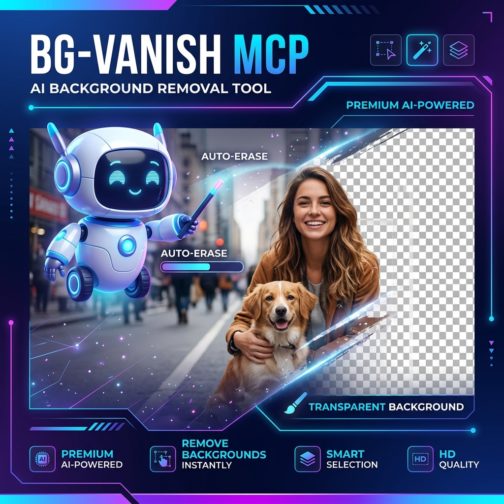

<div align="center">
  

  # BG-Vanish MCP Server

  **Remove backgrounds from images instantly — 100% local, 100% private.**

  [](https://www.python.org/downloads/)
  [](https://pypi.org/project/bg-vanish-mcp/)
  [](LICENSE)

</div>

No cloud APIs. No uploads. No subscriptions. Your images never leave your machine.

Works with **Claude Desktop**, **Cline**, **Continue**, **Cursor**, **Windsurf**, **VS Code Copilot**, **Goose**, and any MCP-compatible AI assistant.

---

## Quick Start

```bash
pip install bg-vanish-mcp
bg-vanish-mcp
```

That's it. The first background removal will download the AI model automatically (one-time, ~176 MB). After that, everything runs fully offline.

**When it starts, you'll see:**
```
Initializing rembg session on CPU...
```

---

## How to Use It

Pick your AI assistant below for the exact setup. In all cases, `bg-vanish-mcp` must be installed first (`pip install bg-vanish-mcp`).

### 🟣 Claude Desktop

**Config file:** `claude_desktop_config.json`

| OS | Location |
|----|----------|
| macOS | `~/Library/Application Support/Claude/claude_desktop_config.json` |
| Windows | `%APPDATA%\Claude\claude_desktop_config.json` |
| Linux | `~/.config/Claude/claude_desktop_config.json` |

```json
{
  "mcpServers": {
    "bg-vanish-mcp": {
      "command": "bg-vanish-mcp"
    }
  }
}
```

Then ask: *"Remove the background from this photo"*.

---

### 🔶 Cline (VS Code extension)

**Config file:** `~/.cline/mcp.json`

Or open Cline panel → click the **MCP Servers icon** (stacked servers) → **Configure MCP Servers**.

```json
{
  "mcpServers": {
    "bg-vanish-mcp": {
      "command": "bg-vanish-mcp"
    }
  }
}
```

Then ask: *"Remove the background from this image"*.

---

### 🟢 Continue.dev

**Config:** Create a file in your project's `.continue/mcpServers/` directory.

```bash
mkdir -p .continue/mcpServers
```

Create `.continue/mcpServers/bg-vanish.json`:

```json
{
  "mcpServers": {
    "bg-vanish-mcp": {
      "command": "bg-vanish-mcp"
    }
  }
}
```

---

### 🔵 Cursor

**Config file (project):** `.cursor/mcp.json`

**Config file (global):** `~/.cursor/mcp.json`

```json
{
  "mcpServers": {
    "bg-vanish-mcp": {
      "command": "bg-vanish-mcp"
    }
  }
}
```

---

### 🟠 Windsurf

**Config file:** `~/.codeium/windsurf/mcp_config.json`

Or via Windsurf Settings → Plugins/MCP Servers → Configure.

```json
{
  "mcpServers": {
    "bg-vanish-mcp": {
      "command": "bg-vanish-mcp"
    }
  }
}
```

---

### 🔵 VS Code (GitHub Copilot)

**Config file (project):** `.vscode/mcp.json`

**Config file (global):** Open Command Palette → `MCP: Open User Configuration`

> [!NOTE]
> VS Code uses `"servers"` as the root key instead of `"mcpServers"`.

```json
{
  "servers": {
    "bg-vanish-mcp": {
      "command": "bg-vanish-mcp"
    }
  }
}
```

---

### 🟤 Goose

Use the Goose CLI to add the server:

```bash
goose configure
```

Then follow the prompts to add a **stdio** MCP server with command `bg-vanish-mcp`.

---

### 🟢 Zed Editor

**Config file:** `~/.config/zed/settings.json`

```json
{
  "mcp_servers": {
    "bg-vanish-mcp": {
      "command": "bg-vanish-mcp"
    }
  }
}
```

---

### ⚪ Using a virtual environment

If you installed in a virtual environment, use the full paths instead:

```json
{
  "mcpServers": {
    "bg-vanish-mcp": {
      "command": "/path/to/.venv/bin/python",
      "args": ["-m", "bg_vanish_mcp"],
      "env": {
        "USE_GPU": "true"
      }
    }
  }
}
```

---

### Try it right now

```bash
python test_server.py
```

You'll see:
```
Created test image: test_input.png
Removing background...
Success! Output: test_output.png
Verification PASSED: Output has transparency.
```

That confirms everything is working.

---

## Installation Options

### Standard install

```bash
pip install bg-vanish-mcp
```

### With GPU (faster processing)

**Windows (any GPU):**
```bash
pip install bg-vanish-mcp[dml]
set USE_GPU=true
```

**Linux / macOS (NVIDIA only):**
```bash
pip install bg-vanish-mcp[gpu]
export USE_GPU=true
```

GPU not available? No worries — it falls back to CPU automatically.

### Manual setup

```bash
git clone https://github.com/your-username/bg-vanish-mcp.git
cd bg-vanish-mcp
python -m venv .venv
source .venv/bin/activate    # Linux / macOS
# .venv\Scripts\activate     # Windows
pip install -r requirements.txt
```

---

## What You Can Do

- **Remove backgrounds from photos** — product shots, portraits, anything
- **Get transparent PNGs** ready for design work, e-commerce, or presentations
- **Process images from anywhere** — your file system or pasted directly as base64
- **Keep everything private** — no data ever leaves your computer

---

## License

MIT — use it freely.

---

<div align="center">
  Made for anyone who wants fast, private background removal.
</div>
